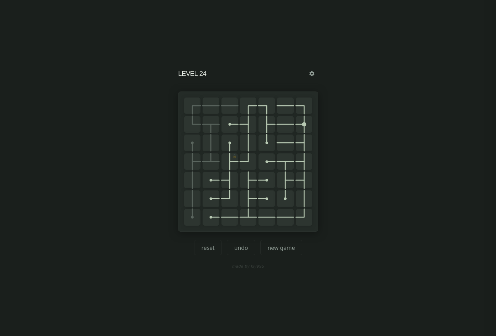

# pipzzle

pipzzle is a small pipe puzzle game where you rotate tiles to connect every pipe.

  

[play online](https://kiy995.github.io/pipzzle/)

## keys

- r: reset level
- u: undo
- n: new game
- esc: close

## license

MIT License